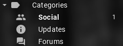
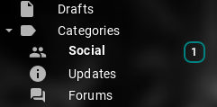
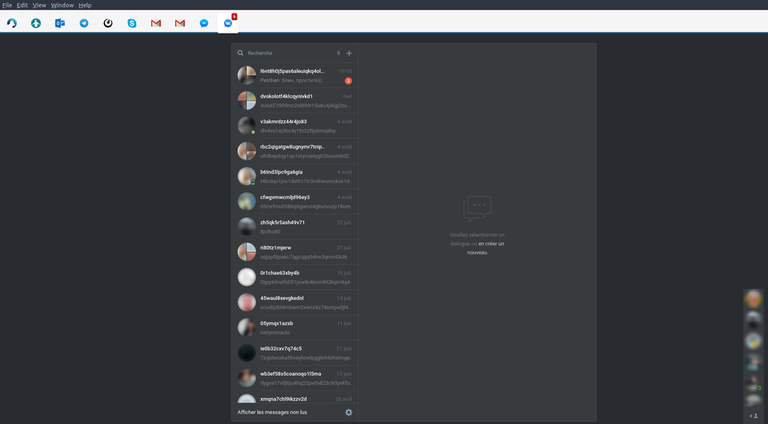
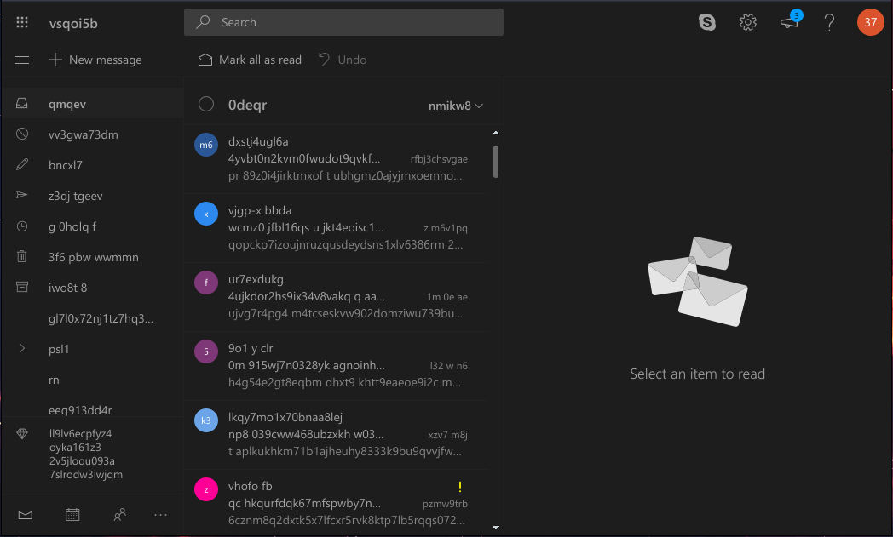

# Extensions for Rambox services

Rambox's [Inject JavaScript Code](https://github.com/saenzramiro/rambox/wiki/Inject-JavaScript-Code) feature is very useful - injecting custom JS code allows also inject custom CSS per service which can work as ~[Stylish](https://userstyles.org/)~ [Stylus](https://github.com/openstyles/stylus) extensions. Also it can work as simple AdBlock, since you can hide `iframe`s and others elements which show ads. Here I want to collect all my custom JS code which is injected in different messengers.

## Gmail

#### `gmail.js`
 - hide ad (first one or two emails in the list) in Social and Promotions tabs
 - improve readability of counters on the left panel:
 
 
 
 
#### `gmail-unread-count.js`
 - show number of unread messages

## VK

 - hide sidebar and navbar;
 - use [NewVK Dark Theme](https://userstyles.org/styles/127431/newvk-dark-theme).

## Outlook

#### `outlook.js`
 - hide right panel with ad
#### `outlook-noad-dark.js`
 - hide right panel with ad
 - dark theme: https://userstyles.org/styles/160323/outlook-com-dark-mode 
 
 

#### `outlook-unread-count.js`
- show number of unread messages

## Spike

#### `spike-unread-count.js`
- show number of unread messages
