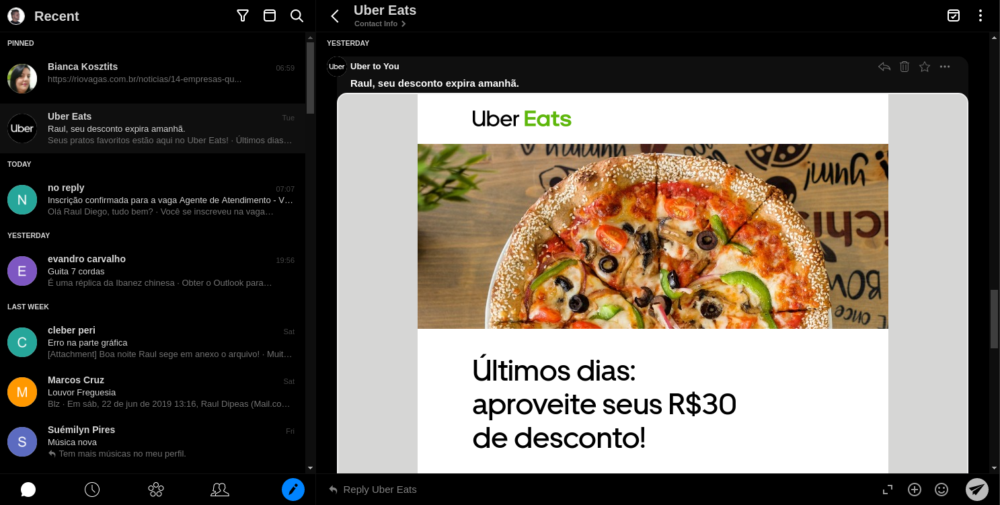

# Extensions for Rambox services

Rambox's [Inject JavaScript Code](https://github.com/saenzramiro/rambox/wiki/Inject-JavaScript-Code) feature is very useful - injecting custom JS code allows also inject custom CSS per service which can work as ~[Stylish](https://userstyles.org/)~ [Stylus](https://github.com/openstyles/stylus) extensions. Also it can work as simple AdBlock, since you can hide `iframe`s and others elements which show ads. Here I want to collect all my custom JS code which is injected in different messengers.

   * [Tricks](#tricks)
      * [Dark panel](#dark-panel)
   * [Styles](#styles)
      * [Gmail](#gmail)
         * [gmail.js](#gmailjs)
         * [gmail-unread-count.js](#gmail-unread-countjs)
      * [VK](#vk)
      * [Outlook](#outlook)
         * [outlook-noad.js](#outlook-noadjs)
         * [outlook-dark.js](#outlook-darkjs)
         * [outlook-unread-count.js](#outlook-unread-countjs)
      * [Spike](#spike)
         * [spike-dark.js](#spike-darkjs)
         * [spike-unread-count.js](#spike-unread-countjs)


# Tricks

## Dark panel

To make the panel dark you can edit the CSS by using the Developer Tools: **Window** -> **Toggle Developer Tools**. Then choose Console and paste following JS there:

```js
document.querySelector('.x-tab-bar').style.backgroundColor='#20272D';
document.querySelectorAll('.x-tab').forEach(function(el){el.style.backgroundColor='#40474D';});
```

First line sets the color of the bar and second of the tabs. Result will look following way:


Note that this will work only until you close application. Every time you start it you'll need to run the above JS again (which is just: 
 - `Ctrl` + `Shift` + `i` - open developer tools
 - `up` - select previous command 
 - `Enter` - run it
 - `Ctrl` + `Shift` + `i` - close developer tools


# Styles

## Gmail

#### `gmail.js`
 - hide ad (first one or two emails in the list) in Social and Promotions tabs
 - improve readability of counters on the left panel:

 
 

#### `gmail-unread-count.js`
 - show number of unread messages

## VK
 - hide sidebar and navbar;
 - use [NewVK Dark Theme](https://userstyles.org/styles/127431/newvk-dark-theme).

 

## Outlook

#### `outlook-noad.js`
 - hide right panel with ad

#### `outlook-dark.js`
 - dark theme: https://userstyles.org/styles/160323/outlook-com-dark-mode

 

#### `outlook-unread-count.js`
 - show number of unread messages

## Spike

#### `spike-dark.js`
 - dark theme made by [rauldipeas](https://github.com/rauldipeas)
 

#### `spike-unread-count.js`
 - show number of unread messages
